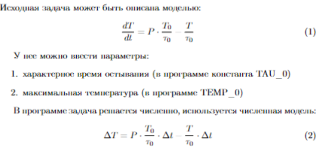

# Описание программы "позиционный регулятор"

## мат. модель


## `plot.py`
`plot.py` - файл с функцией `plot`

функция `plot` прикрепляет график к окну приложения

```py
from tkinter import *
from matplotlib.figure import Figure 
from matplotlib.backends.backend_tkagg import (FigureCanvasTkAgg, 
NavigationToolbar2Tk) 

# plot function is created for 
# plotting the graph in 
# tkinter window 
def plot(window, data): 

    # the figure that will contain the plot 
    fig = Figure(figsize = (5, 5), 
                dpi = 100) 

    # adding the subplot 
    plot1 = fig.add_subplot(111) 

    # plotting the graph 
    plot1.plot(data) 

    # creating the Tkinter canvas 
    # containing the Matplotlib figure 
    canvas = FigureCanvasTkAgg(fig, 
                            master = window) 
    canvas.draw() 

    # placing the canvas on the Tkinter window 
    tk_widget = canvas.get_tk_widget() 
    tk_widget.pack()

    # creating the Matplotlib toolbar 
    toolbar = NavigationToolbar2Tk(canvas, 
                                window) 
    toolbar.update() 

    # placing the toolbar on the Tkinter window 
    canvas.get_tk_widget().pack() 
    return (plot1, canvas)
```

## `setup_window.py`
`setup_window.py` - файл с функцией `setup_window`

функция `setup_window` инициализирует окно и производит расчет показаний виртуального прибора
```py
import tkinter as tk

import numpy as np
from plot import plot

TIMER_INTERVAL = 30
TAU_0 = 30
TEMP_0 = 100
T_INI = 0
T_SP = 5
HE = 0.0

def iteration(T, delta_t, p_relative):
    delta_T = (p_relative * TEMP_0 / TAU_0 - T / TAU_0) * delta_t
    return T + delta_T

def compute_p(T):
    if T >= T_SP - HE:
        return 0
    return 1

def setup_window():
    window = tk.Tk()
    lbl = None
    T_value = T_INI
    T_all_values = [T_value]
    (ax, canvas) = plot(window, T_all_values)

    def timer_tick():
        nonlocal T_value
        p_relative = compute_p(T_value)
        res = iteration(T_value, TIMER_INTERVAL / 1000, p_relative)
        T_value = res
        T_all_values.append(T_value)
        lbl.config(text=res)
        domain = np.arange(len(T_all_values)) * TIMER_INTERVAL
        ax.plot(domain, T_all_values, color='blue')
        ax.set_xlim((max(0, domain[-1] - 10 * 1000), domain[-1]))
        canvas.draw()
        window.update()
        window.after(TIMER_INTERVAL, timer_tick)
    lbl = tk.Label()
    lbl.pack()
    window.after(0, timer_tick)
    window.geometry("500x500")
    window.mainloop()
```

## работа программы
для начала работы необходимо выполнить консольную команду 
```sh
py index.py
```
находясь в папке проекта

в результате должно появится окошко на котором будет рисоваться график в реальном времени. снизу от графика написано текущее значение температуры и чекбокс выступающий в роли индикатора включения/выключения мощности.

